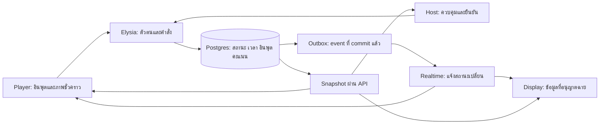

# สัญญาระบบกลางก่อนสร้างเกม — HUMAN vs AI

6 ตุลาคม 2026 · เอกสารออกแบบ ยังไม่ใช่โค้ดหรือ migration ที่ใช้งานแล้ว

ใช้คู่กับ [แผนสร้างรายเกม](game-build-plan.md) และ [spec.md](../spec.md) เพื่อให้เกมใหม่ใช้ฐานเดิมโดยไม่เปลี่ยนสิทธิ์ เวลา หรือคะแนนของเกมก่อนหน้า รอบนี้จบแผนก่อนตามที่ผู้ใช้ยืนยัน

## 1. สิ่งที่ยืนยันแล้วและข้อเสนอทางเทคนิค

ผู้ใช้ยืนยัน 32 คน แบ่ง 8 กลุ่มตามชื่อใน `spec.md` โดยไม่บังคับจำนวนสมาชิกต่อกลุ่ม ทุกคนเล่น/ส่งงาน/โหวตเอง ใช้ roster ณ Start **ไม่มีผู้ช่วย ผู้จัดตรวจเอง** และพักการออกแบบ layout Host ไว้ก่อน

ข้อตกลงจบเกมล่าสุด: **ทุกเกมรอผู้จัดกด “จบเกม / ไปต่อ” เองหลังเกมเสร็จ** คำสั่งเดียวรวม confirm คะแนน/complete run/ไป cue ถัดไป ไม่มีการจบเกมอัตโนมัติหรือปุ่มยืนยันแยกที่ต้องกดเพิ่ม

ช่วงตรวจงานเกมละ 60 วินาทีสำหรับเกม 3/7 การย้ายเวลาอภิปรายเกม 1 มาให้เกม 3 โหมดกระชับ ค่า latency และโครง schema/API เป็น **ข้อเสนอการสร้างจากแผนนี้** ต้องทดสอบและซ้อมก่อนรับรองพร้อมใช้ ชื่อกลุ่มไม่ใช่สิ่งที่ต้องรอเพื่อเริ่มพัฒนา

## 2. ข้อมูลหลักและขอบเขตความรับผิดชอบ

| ข้อมูล | แหล่งหลัก | สิ่งที่ไม่ใช้แทน |
|---|---|---|
| สมาชิก/กลุ่ม/สิทธิ์ | membership และ room roles ใน DB | ชื่อเล่น Presence หรือ user-editable metadata |
| คนมีสิทธิ์ในเกม | immutable run roster | จำนวนคนออนไลน์หรือสมาชิกใหม่ |
| cue/run/phase/deadline | room/run ใน DB | index สไลด์ timer ของแท็บ หรือ BroadcastChannel |
| คำตอบ/เส้น/ตำแหน่ง | accepted input พร้อม receipt | local draft หรือผล animation |
| คะแนนรวม | confirmed scoring run ต่อเกม | score ที่ client ส่งมา หรือจำนวนครั้งที่เปิดหน้าผล |
| ความเหมาะสมของงาน | moderation decision ของ locked revision | ผ่าน schema อย่างเดียวหรือไม่มีใครกด reject |
| สถานะออนไลน์ | Presence แยกจากสมาชิก | เงื่อนไขลบสมาชิก/ลดตัวหาร |

เกมแต่ละเกมส่งออกเพียงคำจำกัดความเฟส content validator/input reducer/scorer และ view ของตน ไม่สร้างระบบ auth/clock/reconnect/confirmation อีกชุด

## 3. เงื่อนไขที่ห้ามละเมิด

| รหัส | เงื่อนไข | วิธีบังคับหลัก |
|---|---|---|
| F01 | หนึ่งห้องมี run ที่ยังไม่จบได้หนึ่ง run | transaction + unique constraint ของ active nonterminal run |
| F02 | หนึ่งผู้เล่นใน run มี groupId เดียวและ denominator ไม่เปลี่ยน | unique(runId,playerId), roster immutable |
| F03 | ผู้เข้าหลัง Start ไม่มีสิทธิ์ย้อนหลัง | ตรวจ roster ทุกอินพุต |
| F04 | Presence offline ไม่ลบสิทธิ์เดิม | membership/Presence แยกข้อมูล |
| F05 | Pause ไม่คืนชีวิต ไม่คืนคะแนน และไม่รับอินพุตใหม่ | phase fence + active elapsed clock |
| F06 | คำขอเดิมได้ผลเดิมหลัง retry | persisted idempotency receipt + payload hash |
| F07 | คำตอบแรกเกม 2/4 เปลี่ยนไม่ได้ | unique round answer และ transaction |
| F08 | เกม 3/7 หนึ่งงานต่อคน หนึ่งเสียงต่อเฟส | unique submission/vote + resource revision |
| F09 | ผู้เล่นปลอมกลุ่ม/คะแนน/สิทธิ์ Host ไม่ได้ | actor จาก JWT ที่ตรวจแล้ว + membership/role ใน DB |
| F10 | คะแนนของเกมนับจากหนึ่ง run ที่ confirmed เท่านั้น | active scoring pointer + confirmation transaction |
| F11 | ย้อน cue ไม่เริ่ม run และไม่บวกผลซ้ำ | stable cue mapping + completed run lookup |
| F12 | event หาย/เก่า/ซ้ำ ไม่ทำให้ state ผิด | version scope + snapshot reconcile |
| F13 | ไม่มีคำเฉลย/งาน pending/คะแนนคนอื่นใน payload จอ/Player | serializer แยก role/phase + authorization tests |
| F14 | ย้าย/เปลี่ยนชื่อกลุ่มไม่แก้คะแนนเกมที่ผ่านมา | groupId คงที่ + roster audit |
| F15 | ทุกเกมจบ/ไปต่อจากการกดผู้จัดเท่านั้น และกดซ้ำไม่ข้ามคิวเพิ่ม | finish-and-next transaction + receipt; RESULT ไม่มี auto-complete deadline |

## 4. เวลา ขอบเขตเฟส และการแข่งขันของคำสั่ง

### 4.1 นาฬิกาเดียว

- เวลาเก็บ UTC ใน DB; ใช้ millisecond timestamp สำหรับการเดินสนาม ใช้ active elapsed milliseconds สำหรับ schedule เกม 1/5/6/7
- เวลาให้คะแนนจาก `clock_timestamp()` ฝั่ง DB หลังผ่านตัวตนและได้ lock ที่กำหนด; `acceptedAt` ต้องอยู่ใน transaction เดียวกับ input/receipt ห้ามใช้ browser clock หรือเวลารับของคนละ Vercel instance เป็นคำตัดสินคะแนน
- ช่วงรับคือ **startAt ≤ acceptedAt < deadline**; ตรง deadline ถือว่าปิดแล้ว ไม่ใช้ `≤ deadline` บางเกมและ `< deadline` อีกเกม
- เกม 6 ตำแหน่งใช้ได้เมื่อ acceptedAt ≤ railAt ของนัดนั้นและยังอยู่ในเฟสเล่น; การรับหลัง railAt แก้ผลนัดนั้นไม่ได้
- `serverNow` ใน snapshot มาจาก DB เช่นเดียวกัน Player วัด clock offset เพื่อวาดภาพ แต่ไม่ใช้ offset เพื่อยืนยันคะแนน
- ไม่เริ่มเวลาส่วนบุคคลเมื่อโหลดภาพเสร็จช้า ทุกคนใช้ deadline กลาง; คนยังไม่เห็น asset จะไม่เปิดอินพุต
- GAME_READY ไม่มี deadline เล่นเอง; countdown 3 s บันทึกตอน Start และ trial/practice แยกจาก scoring run

### 4.2 Pause/Resume และ phase fence

ทุกเฟสมี `phaseToken` ที่เปลี่ยนเมื่อ advance/Pause/Resume/Cancel/replay supersede อินพุตต้องส่ง token ปัจจุบัน เพื่อปฏิเสธคำขอที่ค้างจากเฟสเดิมแม้ชื่อเฟสกลับมาเป็น PLAYING เหมือนเดิม

Pause transaction คำนวณ remainingMs แล้วบันทึก pausedAt/activeElapsedMs; หยุดทั้งภาพและสิทธิ์อินพุต Resume สร้าง deadline ใหม่จาก remainingMs ไม่เลื่อนคำตอบ/เส้นที่ commit ไปแล้ว

หาก Pause เข้าถึง DB หลัง deadline ให้ reconcile เฟสที่หมดก่อน แล้วพิจารณาพักเฟสปัจจุบัน ไม่มีการพักย้อนหลังเพื่อคืนช่วงตอบที่หมดแล้ว มีปุ่ม Resume ได้เมื่อ paused จริงเท่านั้น

### 4.3 Advance และการค้างโดยตั้งใจ

GAME_READY อยู่ใน preview ก่อนสร้าง run; `run.status` = RUNNING / RESULT / CONFIRMED / COMPLETED / CANCELLED; `run.phase` = เฟสเฉพาะเกม; `paused` เป็น overlay จึงไม่เขียนเฟส PAUSED จนลืมว่าอยู่รอบอะไร

- Advance เรียกจาก snapshot/Player input/Host ได้ แต่ต้องเป็น **reconcile ตาม deadline** เท่านั้น; Player เรียกเพื่อเดินข้ามเฟสที่ยังไม่ครบไม่ได้
- เฟส deadline ของเกมเดินได้เมื่อมี client fetch แม้ Host ไม่อยู่ ถ้าไม่มี client กลับมาคำนวณจากเวลาที่ผ่านจริง
- เฉพาะเฟสรับอินพุตปิดตามเวลาแน่นอน; เฟสผล/อภิปรายเป็นเป้าหมายเวลา RESULT ค้างจน Host กด Finish-and-next เองและไม่มี deadline ที่ complete/เลื่อน cue; timer/advance/worker เปลี่ยนเฟสรับอินพุตได้ แต่ยืนยันคะแนน/จบ run แทน Host ไม่ได้
- เฟสตรวจงานมี publication barrier: เมื่อ deadline ครบแล้วมี pending ให้สถานะ `REVIEW_REQUIRED` และหยุดก่อนโหวตจนผู้จัดแก้/ตัดสิน ไม่เปิดโหวตโดยตัดงานท้ายคิวออกอัตโนมัติ
- งานหนึ่งที่ตัดสินชัดเจนว่าไม่ผ่าน/ส่งไม่ครบแสดงเหตุผลให้เจ้าของ; ปัญหาคิวตรวจทั้งระบบต้อง Pause หรือ Cancel และแจ้งผู้จัด
- การค้างตรวจ/ผลทำให้เวลางานเกินได้ จึงต้องบันทึก elapsed และใช้จุดตัดเวลา ไม่มีการอ้างซ้อมครบ 50 นาทีหาก barrier นี้ยังไม่ผ่าน

## 5. คำสั่ง ส่งซ้ำ และหลายแท็บ

### 5.1 Receipt ของทุก mutation

`idempotencyKey` scoped โดย actorId + roomId/runId + command kind; เก็บ canonical payload hash, accepted/rejected outcome, authoritative revision และ timestamp

1. ตรวจ actor ก่อนค้น receipt ห้ามคืนข้อมูลของคนอื่นจาก key ที่เดาได้
2. key เดิม + payload เดิม → คืน receipt เดิม แม้ตอน retry เฟสปิดแล้ว; นี่เป็นการอ่านผลเดิม ไม่รับอินพุตใหม่
3. key เดิม + payload ต่าง → `IDEMPOTENCY_CONFLICT` ไม่ใช้ last write wins
4. ไม่มี receipt → ตรวจ current fence/สิทธิ์/deadline แล้ว commit input + receipt; การ reject ที่ตัดสินแล้วเก็บเหตุผลได้ตาม scope เดียวกัน
5. Timeout หลัง commit → client fetch/retry key เดิม; ห้ามสร้าง key ใหม่ทันทีแล้วขึ้นว่าได้สองคำตอบ

Host command ใช้ expected room/control version; Player input ใช้ phaseToken และ resource revision/sequence ไม่ใช้ room version ที่เพิ่มเพราะผู้เล่นคนอื่น

### 5.2 แต่ละชนิดอินพุต

| อินพุต | ข้อกำหนด |
|---|---|
| ครั้งแรกล็อก: เกม 2/4 | unique ต่อ player/round; เมื่อได้คำตอบแล้ว retry เดิมได้ แต่คำตอบต่าง rejected |
| แก้ได้: caption/vote | revision monotonic ต่อ resource, ใช้ expectedRevision ป้องกัน draft เก่าจากอีกแท็บทับใหม่ |
| แตะ/ทุบ | event ID ไม่ซ้ำ accepted ครั้งเดียว เก็บผลราย event ใน batch และเพดานรวมรายคน |
| shield movement | sequence monotonic, finite normalized coordinates, รับตามเวลา DB; sequence เก่าที่ไม่เคยรับไม่ backfill ตำแหน่งย้อนหลัง |
| artwork operations | sequence/revision ต่อเอกสาร, undo/clear เป็น operation, finalize ล็อก revision และ hash |

แผนฐานเสนอหนึ่ง input writer ต่อ player/run สำหรับ arcade/artwork โดยออก `inputEpoch` ฝั่ง server การเปิดหน้าอ่านหรือ reconnect snapshot ไม่ยึด writer เอง ถ้าเปิดอีกแท็บให้ read-only จนผู้เล่นกด “เล่นต่อที่แท็บนี้” แล้วเปลี่ยน epoch แบบ atomic ข้อมูล/คะแนน/ชีวิตเดิมคงอยู่ คำสั่ง writer เก่าปฏิเสธหลังเปลี่ยน epoch

การกู้ browser/profile เดิมใช้ identity เดิมโดย session ไม่เปลี่ยนเครื่องด้วยชื่อเล่น การเสีย storage/ออกเองไม่รับรองกู้ identity; explicit leave จบสิทธิ์ส่งของ membership นั้น แต่ roster/คะแนนที่ผ่านมายังอยู่

## 6. Transaction และการรับโหลด

### 6.1 ขอบเขต transaction

| คำสั่ง | สิ่งที่ต้อง atomic |
|---|---|
| Start | ตรวจ cue/Host/version → สร้าง run + roster + versions + deadlines → ล็อกทีมถ้าเกม 1 → room pointer → receipt/outbox |
| Player input | ตรวจ phase fence และ roster → event/resource + player state → receipt; ส่งเฉพาะ private acknowledgement |
| Advance | ปิดเฟส/ล็อก revision/ชีวิต/packet/candidate ตามเกม → deadline ถัดไป → version/outbox |
| Finish-and-next | สรุป input ที่ล็อก → final scores/confirmation → active scoring pointer → COMPLETED → nextCue/room pointer → receipt/outbox; score calculation failed ต้อง rollback ทั้งหมด |
| Replay | ตรวจสิทธิ์/เหตุผล → supersede/cancel run เดิมและเอาออกจากคะแนนที่นับ → เตรียมเกมใหม่ → receipt/outbox; run ใหม่ยังไม่เข้าคะแนนจน confirmed |
| Takeover | ตรวจสิทธิ์/lease → เพิ่ม controllerEpoch/เจ้าของ lease → audit/receipt; machine เก่าใช้ token เดิมไม่ได้ |

ไม่เรียก Storage/Realtime ภายใน transaction ที่ล็อกคะแนน thumbnail เป็น job ที่เรียกซ้ำได้ตาม locked hash ส่วน outbox commit ก่อนส่ง Realtime ผลคะแนนไม่ rollback เพราะ broadcast ล้มเหลว

การคำนวณคะแนนใช้ pure scorer ฝั่ง backend จากชุดอินพุตที่ finalize เป็น immutable แล้ว เก็บ `finalInputRevision/digest` กับ scoringVersion เมื่อเข้า RESULT; Finish-and-next RPC ตรวจ digest/runVersion เดิมก่อน commit คะแนนและไป cue ถัดไปในครั้งเดียว หากชุดข้อมูลเปลี่ยนต้องคำนวณใหม่หรือ Cancel ไม่คำนวณจาก read หลายคำขอที่ยังเปลี่ยนอยู่ และไม่รับผล scorer จาก Player

หากคำขอ Finish-and-next ซ้ำด้วย key เดิมคืน receipt เดิม หาก key ใหม่แต่ run COMPLETED แล้วให้ `ALREADY_COMPLETED` พร้อมผลเดิม ไม่เดินหน้า cue อีกครั้ง ถ้ายัง PLAYING/REVIEW_REQUIRED ให้ `GAME_NOT_FINISHABLE` ปุ่มไปต่อไม่ใช่ทางข้ามช่วงเล่น/ตรวจ

### 6.2 เนื้อหาและขอบเขต module

- Registry ของแต่ละ gameId ระบุ cue/nextCue, public content loader, server-only answer loader, phase schedule, input schema, reducer และ scorer; cue mapping อ้าง ID ตามลำดับ src/content.ts ไม่ sort ID
- `contentVersion/scoringVersion/scheduleVersion` ล็อกเมื่อ Start; ใช้ version เดิมตอน replay input/คำนวณ export ไม่อ่านไฟล์ล่าสุดของ deployment แทนไฟล์ที่ run ใช้
- TypeScript ใน src/shared มีเฉพาะ types/config ที่เปิดเผยได้ ตัว scorer/answer loader ที่มีเฉลยอยู่ backend เพื่อไม่ให้ Vite bundle รวม answer key แม้ UI ไม่ใช้
- มี startup/content validation ก่อนเปิด GAME_READY: asset/answer key/จำนวนรอบ/คะแนนเต็ม/เฟสรวมเวลา/รูปแบบภาษาตรงกัน ถ้า content ฝั่งระบบไม่ครบให้บล็อก Start ด้วยเหตุผล ไม่ใช้ fallback เฉลยว่าง
- หลัง release ห้องที่กำลังเล่นไม่รับ deploy ที่เปลี่ยน versions กลาง run; rollback ต้องยังอ่าน version ที่ใช้จริงได้

### 6.3 Lock และ index

- ไม่ update room row ทุก tap/move/checkpoint; ใช้ receipt/player/resource rows และสรุปรวมลดความถี่ มิฉะนั้น 32 คนยังแย่ง lock เดียว
- ฝั่ง input ต้องถือ run gate แบบ shared ระหว่างตรวจและ commit ส่วน Pause/Advance/Confirm ใช้ exclusive gate เพื่อให้ไม่มี input แทรกหลังเฟสปิด; ลำดับ lock เริ่ม run gate แล้ว player/resource ที่เรียง ID เหมือนกัน
- Snapshot ที่อ่านเฟสยังไม่หมดไม่ต้อง exclusive lock; ถ้าต้อง reconcile ให้ transaction สั้นและ re-read version หลังได้ lock
- Timestamp ที่ใช้รับอินพุตอยู่หลัง lock ตาม §4.1 รวมเวลารอ DB ใน latency ที่วัด ไม่รับคะแนนย้อนหลังเพราะคำขอมาถึง HTTP handler ก่อน deadline
- กำหนด index ตาม lookup: membership(roomId,authUserId), roster(runId,playerId), events(runId,playerId,sequence), answers(runId,roundId,playerId), reviews(runId,status,groupId), votes(runId,voteType,playerId), outbox(deliveredAt,eventId) ตามผล EXPLAIN
- Foreign keys ที่ค้น/ตรวจสิทธิ์ต้องมี index เหมาะสม; ทดสอบ query plan ของ snapshot/confirmation/RLS ที่ข้อมูลหลายห้อง ไม่อ่านทุก record ของทุกกิจกรรม
- Batch tap/operations ใช้หนึ่ง transaction ต่อ batch ลด roundtrips; snapshots/aggregates ไม่คืน event log ทั้งก้อนให้ทุก Player
- ย้าย thumbnail render จากคำขอวาดไป job ที่กู้ได้ เก็บสถานะ QUEUED/RENDERING/READY/FAILED และ retry ตาม locked hash; เป้าหมาย 5 s ต้องพิสูจน์ด้วย 32 งาน

### 6.4 งานเบื้องหลังที่ Function หยุดแล้วต้องกู้ได้

- ข้อเสนอรุ่นแรก: เก็บ `render_jobs` และ `outbox` ใน schema ของแอป ใช้ DB lease/attempt count และ worker endpoint ของ Elysia ที่ต้องมี server credential; endpoint claim งานแล้ว **await** render/upload/บันทึกผลก่อนจบ ไม่ปล่อย Promise ทำงานหลัง HTTP response
- ใช้ Supabase Cron + pg_net เรียก worker เป็นตัวตรวจงานค้างทุก 1 วินาทีเฉพาะระหว่างมีห้อง active แทน setTimeout ใน Vercel Function; ไม่ส่งคำขอถ้าไม่มี pending และไม่มี lease หมดอายุ ปิดงานประจำเมื่อปิดห้อง
- เริ่ม concurrency งานภาพ 4 งานและปรับตามผลโหลด; claim แบบ SKIP LOCKED/lease คงที่, output path/hash unique, retry ไม่สร้างภาพซ้ำ ถ้า worker ตาย lease หมดแล้ว worker ใหม่รับต่อได้
- งาน outbox ปกติพยายามส่งทันทีหลัง commit โดย await ภายในคำขอที่เกี่ยวข้อง ส่วน Cron กู้เมื่อส่งไม่สำเร็จ/คำขอหยุดก่อนส่ง; คะแนนที่ commit แล้วอ่านผ่าน snapshot ได้ระหว่างรอส่ง
- สิทธิ์ worker token เก็บใน backend/DB Vault ตาม config ที่เลือก ไม่ลง frontend/query URL/log; แยกจาก JWT ของ Host และจาก QR
- P01 ต้องทดลองการเรียก HTTP, timeout, lease/retry และ renderer บน runtime ที่เลือกก่อนล็อกวิธีนี้; pg_net API ต้องตรวจ signature ตามรุ่นที่ติดตั้ง เป้าหมาย 5 s ยังไม่ผ่านถือว่าเกม 7 ยังไม่พร้อม
- หน้าที่ Cron ในข้อนี้มีเฉพาะ drain jobs/outbox ไม่เปลี่ยน scoring phase แทนกติกา reconciliation และไม่เริ่มเกมเองเมื่อถึงเวลา

## 7. คะแนน ตัวแทน และการเปลี่ยนผลหลังเปิดโหวต

- คะแนนรายคน finalized ก่อนเฉลี่ยกลุ่ม; game 4 DEAD = 0, game 5 clamp หลังรวม raw score, สมาชิกไม่เล่นเป็น 0
- คะแนนเฉลี่ยเก็บ numerator/denominator ไม่ใช้เลขแสดงสองทศนิยมจัดอันดับ คะแนนสะสมเปรียบเทียบผลบวกเศษส่วนแบบ exact; DB เก็บส่วนประกอบหรือ rational ไม่บวก float
- เกม 3/7 ใช้ roster denominator แม้บางคนไม่โหวต eligible groups ดูจาก roster ไม่จากกลุ่มที่ส่งงาน; กลุ่มว่างไม่เข้า average
- Candidate map ล็อกก่อน INTERNAL/FINAL ตามจังหวะของแต่ละชุด ชื่อเจ้าของไม่อยู่ใน payload final vote; sharedScore ที่ปัดเป็นจำนวนเต็มคือคะแนนจริงของ creative game
- ก่อนเปิด FINAL_VOTE ตรวจทุก candidate ยัง approved และ lockedRevision/hash ตรง
- หลังเปิด vote แล้วหากต้องซ่อน candidate ให้หยุดการเผยแพร่ทันทีและเข้าสู่ผล `REVIEW_REQUIRED`; **ไม่โอนเสียง ไม่เลือกตัวแทนสำรอง และไม่ normalize คะแนนใหม่อย่างเงียบ ๆ** ผู้จัด Cancel/Replay run ตามเหตุผลก่อนคิดคะแนน
- Confirmed score ไม่แก้ในแถวเดิมลับ ๆ; ถ้าผลเดิมผิดให้ invalidate/supersede พร้อมเหตุผลและ event ใหม่ ตารางคะแนนคำนวณจาก active confirmed pointer
- การยกเลิกต่างจากคะแนน 0 ทั้งหน้าจอและ export; ถ้าเกมยกเลิกระบุคะแนนเต็มที่มีผลจริงตามเกมที่ยืนยัน ไม่อ้างผู้ชนะครบชุดที่ไม่เคยเล่น

## 8. Snapshot และ event ที่มาผิดลำดับ

Snapshot แยกเป็น room/control, current run/public phase, private player state, allowed aggregates และ role-specific review data ไม่ใช้ serializer เดียวคืน DB record ทั้งก้อนทุก role

| Revision | ขอบเขต | สิ่งที่เพิ่มเลข |
|---|---|---|
| roomVersion | cue/control/team lock/activeRun pointer | คำสั่งจัดกิจกรรม |
| runVersion | phase/deadline/pause/status/public results | Advance/Host run commands |
| resourceRevision | answer/vote/caption/artwork ของคนหนึ่ง | accepted mutation ของ resource นั้น |
| aggregateVersion | สถิติที่อนุญาตฉาย | snapshot รวมตามรอบลดความถี่ |

Event ต้องระบุ version scope จึงไม่เอาเลข resourceRevision ของคนหนึ่งไปเทียบ roomVersion ห้อง Receive event เพื่อรู้ว่าควร fetch/reconcile ไม่ใช้ payload event เติมคะแนนเอง

เมื่อ version ขาด/Realtime reconnect ให้ fetch snapshotล่าสุด ระหว่าง fetch buffer events ที่ใหม่กว่า แล้ว reconcile อีกครั้งถ้ามี event version สูงกว่า snapshot; event เก่าหรือ eventId ซ้ำทิ้งอย่างปลอดภัย Outbox ส่งซ้ำได้และมี event ID คงที่

เมื่อ offline ค้าง snapshot ล่าสุดที่รู้ผลจริง เมื่อคืน state ข้ามหลายเฟสให้แสดงเฟสปัจจุบัน ไม่เล่น countdown/เฉลยเก่าต่อกันเพื่อให้ครบ event ที่พลาด Cache scope ผูก roomId + authenticated identity + release; explicit leave ล้าง cache ส่วนตัว

## 9. สิทธิ์ DB/API/Realtime/Storage

| Role | อ่านได้ | เขียนได้ |
|---|---|---|
| Player | roster กลุ่มตน, private state/score ตน, public phase/approved galleries/กลุ่มรวมตามเฟส | อินพุตตนและ vote ตามสิทธิ์ |
| Display | cue/QR/public game payload/approved gallery/confirmed group results | Presence ของจอเท่านั้น ไม่มีคำสั่งเกม |
| Moderator | lockedงานในห้องที่ได้รับสิทธิ์/คิวตรวจ/เหตุผล | review claim/decision ไม่มี Start/Confirm |
| Host | ข้อมูลคุมห้อง ผล/คิวตรวจ/export ที่มีสิทธิ์ | cue/run commands/team management/role assignments ตามบัญชี |

รุ่นงานนี้ Host มีสิทธิ์ review ด้วยและตรวจเองจากหน้าเดียวกัน Moderator role เป็นความสามารถที่รองรับไว้ ไม่เป็นเงื่อนไขว่าต้องมีผู้ช่วยหรือเครื่องเพิ่ม เกม 3/7 ช่วงตรวจไม่ต้องควบคุมเฟสที่รับอินพุตหรือบรรยายพร้อมกัน

แผนรุ่นแรกเสนอ **mutation ผ่าน Elysia แล้วเรียก Postgres RPC แบบ atomic** RPC command เปิด execute เฉพาะ server role ผู้เล่นไม่เขียน input/คะแนนตรงผ่าน Data API; core tables/answer key/receipts อยู่ schema ภายในที่ไม่ expose

- Elysia ตรวจ JWT ด้วยวิธี server verification ที่ SDK รุ่นที่เลือกสนับสนุน แล้วส่ง actor ID ที่ตรวจแล้วเข้า RPC; RPC ตรวจ role/membership/roster/phase ซ้ำจาก DB ไม่เชื่อ actorId/groupId ใน body ผู้เล่น
- Authorization ใช้ตาราง room roles/membership ปัจจุบัน ไม่ใช้ user_metadata หรือ JWT role เก่าที่ยังไม่ refresh เพื่อสิทธิ์ควบคุม
- แยก user-verification client กับ privileged command client ไม่เปลี่ยน header/session ของ admin client ตาม request ผู้เล่น; secret/service role อยู่ backend เท่านั้น
- Default function execute และ table grants ต้อง revoke/กำหนดอย่างชัดเจนพร้อม RLS; RLS อย่างเดียวไม่ปิด RPC ที่ bypass ภายใต้ service role จึงต้องทดสอบ direct Data API invocation ด้วย
- `SECURITY INVOKER` เป็นค่าเริ่มต้น; ถ้าต้องใช้ helper แบบ definer สำหรับ Realtime lookup ให้ scope แคบ ตรวจ auth.uid() ภายใน ตั้ง search_path ปลอดภัย ไม่ expose schema และ grant เฉพาะการเรียกที่ policy ต้องใช้
- การตั้ง Realtime แก้ policies บน realtime.messages ตามคู่มือ ไม่สร้างตาราง/functions หรือแก้ schema ของ Realtime เพื่อเก็บ outbox ของแอป
- แยก channels สำหรับ backend publication และ user Presence เพื่อไม่ให้ผู้เล่นที่ publish Presence ได้ปลอม state/control event; Player event ที่ยังไม่ยืนยันจาก snapshot ไม่ใช่ authority
- ภาพก่อน approved ใช้ private Storage; แจกข้อมูลภาพผ่าน endpoint ที่ตรวจ role/phase/current approval และปิด cache ตามการเผยแพร่ ไม่ออก signed URL ของงาน pending ให้ผู้ชม
- งานที่เคยฉายแล้วเรียกคืนสิ่งที่ผู้ชมบันทึกไม่ได้; เมื่อ reject ภายหลังหยุดการแจกใหม่และส่ง event ซ่อนงาน จอ/แกลเลอรีต้องนำออกจาก cache ที่แสดงอยู่
- ห้ามตีความ Storage owner metadata ว่าเป็นคะแนน/สิทธิ์ review และไม่ให้ผู้เล่น replace thumbnail ของ locked revision
- Guest sign-in ต้องซ้อม 32 คนจาก IP เดียวและจัด auth quota ตามจริง บัญชีผู้จัด/เครื่องสำรองไม่ใช้ guest identity

## 10. ประตูตรวจรับฐานก่อนเพิ่มเกมถัดไป

1. เฟส Start/Pause/Resume/Advance/Finish-and-next/Cancel/Replay เดินตามสัญญาได้ด้วย game adapter ตัวอย่างหนึ่งเกมโดยไม่ผูกกับ UI และ RESULT ไม่จบเองเมื่อค้างไว้นาน
2. ลองคำสั่ง Start/Finish-and-next พร้อมกันจากสอง Host และอินพุตตรง deadline/Pause; มีคะแนน/การไปต่อเพียงชุดเดียว ไม่มี state ครึ่ง transaction
3. จำลอง commit สำเร็จแต่ HTTP timeout แล้ว retry key เดิม; receipt/คะแนน/เสียงไม่เพิ่ม
4. ทดสอบ out-of-order events, Realtime หลุด และ HTTP snapshot โดย private score/ชีวิต/เส้น/โหวตตรง DB หลัง reconcile
5. ทดสอบ membership ย้าย/leave/rejoin/เปลี่ยนชื่อกลุ่ม ระหว่าง run ว่า roster และคะแนนย้อนหลังคงเดิม
6. อ่าน/เขียนข้ามห้อง ปลอม actor/Host groupId/client score และเรียก privileged RPC โดยตรงต้องถูกปฏิเสธ
7. ทดสอบ 32 คน burst input และรอ lock รวมในตัวเลข latency; ยืนยันไม่มี room row update ต่อ event
8. Backend adapter อีกเกมต้องเสียบกับ clock/roster/receipts/scoring/confirmation เดิมได้ ไม่ copy room/session engine ไปทำใหม่

ทุกข้อข้างต้นเป็นงานทดสอบเมื่อเริ่มเขียนโค้ด รอบทำแผนนี้ตรวจความสอดคล้องและที่มาเท่านั้น ไม่มีผล DB/query/load test ที่อ้างว่าผ่านแล้ว

## 11. ที่มาของข้อกำกับ Supabase

ตรวจ changelog และคู่มือทางการวันที่ 6 ตุลาคม 2026 ส่วนสัญญาเกม/transaction/role ในเอกสารนี้เป็นการออกแบบโปรเจกต์

- Grants กำหนดการเข้าถึง object และ RLS กำหนดแถว ต้องออกแบบทั้งสองชั้น: [Securing your API](https://supabase.com/docs/guides/api/securing-your-api)
- Storage ใช้นโยบายแยกเพื่อควบคุมวัตถุ: [Storage Access Control](https://supabase.com/docs/guides/storage/security/access-control)
- Realtime schema จำกัดการแก้ object โดยยังตั้ง RLS policies ของ realtime.messages ได้: [Realtime schema changelog](https://supabase.com/changelog/realtime-schema-locked-down-against-modification)
- ก่อนสร้าง migration ต้องตรวจรุ่น Postgres/extensions ที่ใช้จริง ไม่ assume จากเวอร์ชันคู่มือ: [Postgres release changelog](https://supabase.com/changelog/postgres-15-19-17-11-breaking-changes)
- เริ่มพัฒนาต้อง pin SDK/runtime/lockfile และตรวจ API ตามรุ่นอีกครั้ง: [Supabase Changelog](https://supabase.com/changelog)
- Cron รองรับงานช่วงสั้นและ pg_net เรียก HTTP หลัง transaction commit; วิธี worker/lease เป็นข้อเสนอที่ต้องพิสูจน์บน deployment: [Supabase Cron](https://supabase.com/docs/guides/cron), [pg_net](https://supabase.com/docs/guides/database/extensions/pg_net)
