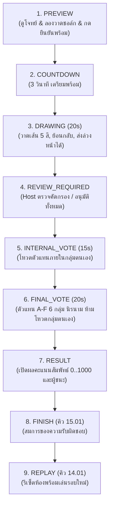

# UI — Missing Piece: AI เริ่ม คนเติม

เกม 7 · `gameId: missing-piece` · คิว `14.01` → `15.01` (“สมการของความรับผิดชอบ” / “THE FUTURE NEEDS A HUMAN SIGNATURE”) · สร้าง 7 ตุลาคม 2026  
ธีมหลัก: **Human & AI Co-Creation & Steampunk Aviator Atelier** (AI สร้างโครงร่างฐานรากของสิ่งประดิษฐ์ไว้ให้ แต่มนุษย์คือผู้เติมเต็มความหมายและจิตวิญญาณ)

---

## 1. ไฟล์สำหรับปรับแก้และดูแลรักษา (File Map)

| หน้าที่ | ตำแหน่งไฟล์ |
|---|---|
| **หน้าจอ Player / Host / Display และ React State** | `src/game-client/PieceGame.tsx` |
| **ดีไซน์ CSS, กระดานวาดเขียน Atelier, Palette, Responsive 320–390px, โต๊ะตรวจ Moderation** | `src/game-client/piece.css` |
| **ระบบสังเคราะห์เสียง Web Audio API (Stroke Draw, Undo, Clear, Color Pick, Fanfare)** | `src/game-client/piece-sound.ts` |
| **เส้นทางเกมในระบบรวม (Routing, Cue Dispatcher, Room Creation, Display Sync)** | `src/game-client/GameApp.tsx` |
| **ภาพพิมพ์เขียวเวกเตอร์อากาศยานกลไก (SVG Blueprint), โซนวาดปีกซ้าย-ขวา, คำบรรยาย** | `api/games/piece-content.ts` |
| **ฐานข้อมูล PostgreSQL, บันทึกเส้น Stroke, ตรวจสอบ Moderation, โหวต 2 ชั้น, คำนวณคะแนนกลุ่ม** | `db/piece.sql` |
| **สัญญาข้อมูล TypeScript Interface และการตรวจสอบความถูกต้อง** | `src/shared/game-contracts.ts`, `api/validation.ts` |
| **ชุดทดสอบสัญญาเกมอัตโนมัติ (Validation, Privacy, Voting Fences, Ties, Finish, Replay)** | `tests/piece-contracts.ts` |
| **สคริปต์ทดสอบ Browser อัตโนมัติ (Playwright 32 คน 6 กลุ่ม ภาพแคปเจอร์ 11 ใบ)** | `scripts/game7-browser-check.mjs` |
| **สคริปต์รันเซิร์ฟเวอร์เฉพาะเกม 7 พอร์ต 5189** | `Start-Game7.cmd` |

---

## 2. โทนสีและอัตลักษณ์ทางสายตา (Visual Identity & Design Tokens)

ใช้ธีม **Steampunk Aviator Blueprint & Creative Atelier Console** (สตูดิโอพิมพ์เขียววิศวกรรมผสมผสานจินตนาการความคมชัดสูง):

- **ฟอนต์:** IBM Plex Sans Thai จากไฟล์ฟอนต์ที่บรรจุในแอป ตามระบบตัวอักษรร่วมใน `DESIGN.md`

- **พื้นหลังหลัก (Atelier Drafting Desk):** `#060b17` / พื้นผิวการ์ด `#0d172a` และ `#162544`
- **สีเส้นขอบตารางและกรอบพิมพ์เขียว (Blueprint Grid):** `#223863` / `#334155`
- **ตัวหนังสือความคมชัดสูงพิเศษ (High Contrast Text):** `#f8fafc` ($\ge 7:1$ contrast ratio)
- **สีพิมพ์เขียววิศวกรรม (Blueprint Cyan):** `#38bdf8` / แสงเรืองรอง `#0284c7` (ใช้กับเส้นโครงร่างและหัวข้อหลัก)
- **สีทองเหลืองนาฬิกาจักรกล (Brass Amber Gold):** `#fbbf24` / `#f59e0b` (ใช้กับไฮไลต์ผู้ชนะและตัวจับเวลา)
- **จานสีสำหรับวาดเขียน 5 สี (5-Color Stylus Palette):**
  1. `#f43f5e` (Rose Crimson — ชมพูกุหลาบแดง)
  2. `#38bdf8` (Cyan Sky — ฟ้าประกายพิมพ์เขียว)
  3. `#fbbf24` (Amber Gold — เหลืองทองคำจักรกล)
  4. `#34d399` (Emerald Mint — เขียวมรกตพลังงาน)
  5. `#f8fafc` (Pure Chalk — ขาวชอล์กไฮไลต์)
- **ขนาดหัวพู่กัน 2 ระดับ:**
  - `4px` (Thin / Fine Line — ลายเส้นโครงละเอียด)
  - `8px` (Thick / Bold Feather — ปื้นสีหรือขนปีกหนา)

---

## 3. แบนเนอร์บริบทค้าง (Pinned Context Banner)

บนหัวจอทุกมุมมอง (Player, Display, Host) จะแสดงกรอบข้อความสีทองอำพันตรึงอยู่ตลอดเวลา:

> 🎨 **โจทย์สร้างสรรค์ (PINNED CONTEXT — MISSING PIECE)**  
> *“เติมปีกให้สิ่งประดิษฐ์นี้พร้อมออกเดินทางในแบบของคุณ: AI ร่างโครงสร้างลำตัวของอากาศยานกลไกไว้ให้แล้ว วาดเติมปีกหรืออุปกรณ์พยุงการบินทั้ง 2 ฝั่งในแบบของคุณภายใน 20 วินาที”*

ผู้เล่นทุกคนในห้อง (32 คน 6 กลุ่ม) จะได้รับภาพฐานรากชิ้นเดียวกันจาก AI แต่จิตวิญญาณและความคิดสร้างสรรค์ของปีกแต่ละคู่จะสะท้อนความหลากหลายของมนุษย์

---

## 4. โครงสร้างอากาศยานกลไกที่ AI ร่างไว้ (Base SVG Asset Blueprint)

ลำตัวกลาง (Central Airship Fuselage & Aviator Pod) ถูกกำหนดพิกัดความละเอียดแบบ Relative Normalized Coordinates `(0..1)` ภายในกรอบ Viewbox `400 x 400`:

```
          (x=0.0)                                       (x=1.0)
     y=0.0 ┌─────────────────────────────────────────────────┐
           │                                                 │
           │   [ 🪶 โซนปีกซ้าย ]               [ 🪶 โซนปีกขวา ] │
           │   x: 0.05..0.41                   x: 0.59..0.95 │
           │   y: 0.24..0.72                   y: 0.24..0.72 │
           │                                                 │
           │                 ┌─────────────┐                 │
           │                 │  ⚙️ ใบพัดบน │                 │
           │                 ├─────────────┤                 │
           │                 │ 🧭 หน้าต่าง │                 │
           │                 │    นักบิน   │                 │
           │                 ├─────────────┤                 │
           │                 │ 🛞 เครื่องยนต์│                 │
           │                 └─────────────┘                 │
           │                 (ลำตัว AI วาดไว้)                │
           │                                                 │
     y=1.0 └─────────────────────────────────────────────────┘
```

- **ลำตัว AI:** ประกอบด้วยโครงโลหะสีทองแดง-บรอนซ์, ใบพัดด้านบน, หน้าต่างกระจกห้องกัปตัน, ฟันเฟืองขับเคลื่อน, และท่อไอพ่น
- **จุดที่ขาดหาย (Missing Pieces):** ด้านซ้ายและด้านขวาถูกเปิดโล่งไว้ ผู้เล่นสามารถวาดปีกขนนก, ปีกค้างคาว, บอลลูนเสริม, ปีกไอพ่น, หรืออะไรก็ได้ตามจินตนาการ

---

## 5. กระบวนการเล่น 5 ระยะ (Game Lifecycle & Flow)



### ระยะที่ 1: PREVIEW (คิว 14.01)
- ผู้เล่นเห็นภาพลำตัว AI และโจทย์
- สามารถทดลองลากเส้นบนหน้าจอ และกดปุ่ม **“👍 ยืนยันพร้อมเล่น”**
- Host ดูจำนวนคนพร้อมจากแท็บผู้จัด

### ระยะที่ 2: COUNTDOWN (3 วินาที)
- ตัวเลขนับถอยหลังสีทองขนาดใหญ่ `3... 2... 1... GO!` พร้อมเสียง Beep

### ระยะที่ 3: DRAWING (20 วินาที)
- **เครื่องมือวาด:**
  - พาเล็ต 5 สี (`#f43f5e`, `#38bdf8`, `#fbbf24`, `#34d399`, `#f8fafc`)
  - ขนาดหัวเส้น: เส้นบาง `4px`, เส้นหนา `8px`
  - ปุ่ม `↩ เลิกทำ (Undo)` และ `🗑️ ล้างทั้งหมด (Clear)`
- **ระบบบันทึกเส้น:** ทุกๆ Stroke จะส่งพิกัดแบบ Normalized `(0..1)` ไปยังเซิร์ฟเวอร์แบบ Real-time พร้อม Revision
- **ปุ่มส่งผลงานล่วงหน้า:** หากผู้เล่นวาดเสร็จก่อน สามารถกด **“🚀 วาดเสร็จแล้ว (ส่งผลงาน)”** เพื่อล็อกภาพทันที
- **ความปลอดภัยและความเป็นส่วนตัว (Privacy Fence):** ในระหว่างวาด จอฉาย Display และผู้เล่นคนอื่นจะเห็นเฉพาะ "จำนวนคนที่ส่งแล้ว" จะไม่มีใครเห็นภาพวาดของผู้เล่นอื่นจนกว่าจะถึงรอบโหวต

### ระยะที่ 4: REVIEW_REQUIRED (ห้องตรวจของผู้จัด)
- เมื่อหมดเวลา 20s ระบบจะล็อกผลงานทั้งหมดโดยอัตโนมัติ
- บนหน้าจอ Host จะแสดงแกลเลอรีภาพวาดของผู้เล่นทุกคนที่ส่งเส้น
- Host สามารถ:
  - กดอนุมัติ/คัดออกทีละภาพ
  - ระบบนับภาพที่ Host เปิดดูในคิวให้เห็นจริง และแสดงความคืบหน้า `ตรวจแล้ว / รอตรวจ`
  - ปุ่มอนุมัติรวมเปิดใช้เมื่อผลงานที่ยังรออนุมัติทุกชิ้นผ่านหน้าจอแล้วเท่านั้น; คำสั่งอนุมัติส่งรายการ ID ที่ตรวจแล้วให้เซิร์ฟเวอร์ยืนยันอีกชั้น
  - จากนั้นกด **“🗳️ เริ่มโหวตภายในกลุ่ม (15s)”**
- หากยังมีงานค้าง เซิร์ฟเวอร์ปฏิเสธการเริ่มโหวตและคงสถานะ `REVIEW_REQUIRED`; ไม่ auto-approve เพื่อให้ทันเวลา

### ระยะที่ 5: INTERNAL_VOTE (15 วินาที)
- **โหวตภายในกลุ่ม (Intra-Group):**
  - ผู้เล่นจะเห็นเฉพาะผลงานของสมาชิกในกลุ่มตนเองที่ผ่านการอนุมัติ
  - ผลงานของตนเองจะมีป้ายกำกับว่า `⭐ งานของคุณ` (สามารถโหวตให้ตนเองได้)
  - ผู้เล่นร่วมกันเลือกผลงานที่คิดว่าดีที่สุด เพื่อส่งเป็นตัวแทนกลุ่มไปประชันกับกลุ่มอื่น

### ระยะที่ 6: FINAL_VOTE (20 วินาที)
- **ประชันตัวแทนระดับห้อง (Inter-Group Vote):**
  - ระบบจะคัดเลือกผลงานที่ได้คะแนนโหวตสูงสุดของแต่ละกลุ่มขึ้นมาเป็นตัวแทนกลุ่ม `A`, `B`, `C`, `D`, `E`, `F`
  - ผลงานจะแสดงแบบ **นิรนาม (Anonymous Showcase)**
  - **กฎเหล็ก (Strict Anti-Bias Rule):** **ผู้เล่นไม่สามารถโหวตให้ตัวแทนกลุ่มของตนเองได้** (การ์ดของกลุ่มตนเองจะขึ้นป้าย `(กลุ่มของคุณ)` และถูกปิดไม่ให้คลิก หากพยายามส่งผ่าน API ระบบจะปฏิเสธด้วยรหัส `OWN_GROUP`)

### ระยะที่ 7: RESULT & SCORING
- Host กด **“🎉 เปิดผลคะแนนและผู้ชนะ (Reveal Results)”**
- จอ Display และมือถือจะแสดงคะแนนสัมพัทธ์ (Normalized Support) และมงกุฎ `👑` สำหรับกลุ่มที่ชนะเลิศ

---

## 6. สูตรการคำนวณคะแนนสัมพัทธ์ (Normalized Support Formula)

เพื่อให้การแข่งขันมีความยุติธรรม แม้จำนวนสมาชิกในแต่ละกลุ่มจะไม่เท่ากัน ระบบใช้สูตร **Normalized Support** เช่นเดียวกับมาตรฐานการแข่งขันระดับสูง:

$$S_g = \frac{1}{|G| - 1} \sum_{k \neq g} \frac{V_{k \to g}}{N_k}$$

- $|G| - 1$ คือ จำนวนกลุ่มอื่นทั้งหมดในห้องที่มีสิทธิ์โหวตให้กลุ่ม $g$
- $N_k$ คือ จำนวนสมาชิกใน Roster ของกลุ่ม $k$
- $V_{k \to g}$ คือ จำนวนคะแนนโหวตที่กลุ่ม $k$ โหวตให้ตัวแทนกลุ่ม $g$
- **สัดส่วนการสนับสนุนสูงสุด:** $1.0$ (คือได้รับความเห็นชอบ 100% จากสมาชิกทุกกลุ่มอื่น)
- UI แสดงสัดส่วนเป็นเปอร์เซ็นต์จำนวนเต็มที่อ่านง่าย; เก็บตัวเศษ/ตัวหารเต็มไว้ใน payload และ export สำหรับตรวจสอบ

### การแปลงเป็นคะแนนรายบุคคลและกลุ่ม:
- **คะแนนเต็ม:** 1,000 คะแนน
- ผู้ชนะอันดับ 1 (หรือเสมอกัน) จะได้รับ **1,000 แต้มเต็ม**
- กลุ่มอื่นจะได้รับคะแนนตามสัดส่วนการสนับสนุนสัมพัทธ์เทียบกับกลุ่มที่ได้อันดับ 1:
  $$\text{Score}_g = \text{round}\left(1000 \times \frac{S_g}{S_{\max}}\right)$$
- **คะแนนเฉลี่ยของกลุ่ม:**
  $$\text{Group Score} = \frac{\sum_{m \in \text{Roster}} \text{Score}_m}{\text{Total Starting Roster Size}}$$

---

## 7. ระบบเสียงเชิงกระบวนการ (Web Audio Synthesizer)

ไฟล์ `src/game-client/piece-sound.ts` ทำงานแบบ 100% Offline Self-Contained โดยไม่พึ่งพาไฟล์ MP3 ภายนอก:

1. **`playStrokeDraw()`**: เสียงลากชอล์ก/พู่กันแบบ White Noise Filtered (Bandpass 800Hz, Q=3, Envelope 0.05s) ให้สัมผัสการวาดเขียนที่นุ่มนวล
2. **`playColorSelect()`**: เสียงคลิกเลือกสี (Sine Wave 520Hz $\to$ 880Hz ใน 0.08s)
3. **`playUndo()` / `playClear()`**: เสียงกวาดล้างภาพ (Descending Sine Sweep 600Hz $\to$ 200Hz)
4. **`playSubmit()`**: เสียงจรวด/เครื่องยนต์อากาศยานติดไฟ (Resonant Low Triangle 140Hz $\to$ 320Hz + Noise Flutter)
5. **`playVote()`**: เสียงหย่อนบัตรลงหีบ (Sub-punch 120Hz พร้อม Acoustic Thud)
6. **`playCountdownTick()` & `playCountdownGo()`**: สัญญาณเตือนนับถอยหลัง 880Hz และ 1760Hz
7. **`playFanfare()`**: เพลงสรรเสริญชัยชนะเมื่อเปิดผลคะแนน (คอร์ด C Major Brass Arpeggio: C5, E5, G5, C6)

---

## 8. คู่มือการเปิดทดสอบและการใช้งานจริง (Operator Guide)

### วิธีเริ่มเซิร์ฟเวอร์แบบ Standalone (Port 5189)
เปิด Terminal หรือดับเบิลคลิกไฟล์:
```cmd
Start-Game7.cmd
```
หรือรันผ่าน PowerShell:
```powershell
$env:GAME_PORT="5189"
$env:GAME_DATA_DIR="data/pg-game7"
npm run game:start
```

- **ลิงก์หน้าผู้จัด (Host):** `http://localhost:5189/games?game=missing-piece`
- **ลิงก์จอฉายห้องประชุม (Display):** `http://localhost:5189/display/<ROOM_CODE>`
- **ลิงก์ผู้เล่นในมือถือ (Player):** `http://<IP_เครื่อง>:5189/play/<ROOM_CODE>`
- รหัสผ่านผู้จัดจะอยู่ในไฟล์ `data/host-key.txt`

### วิธีรันชุดทดสอบความถูกต้อง
1. **รัน Contract Tests ทั้งหมด:**
   ```powershell
   npx tsx --test tests/piece-contracts.ts
   npm run game:test
   ```
2. **รัน Browser End-to-End QA (Playwright 32 คน):**
   ```powershell
   npm run game:qa7
   ```
   ผลการทดสอบและรูปภาพ 11 ภาพจะถูกบันทึกไว้ที่ `qa/game7/`

---

## 9. แนวทางการปรับแต่งในอนาคต (Customization Cheat Sheet)

- **หากต้องการเปลี่ยนภาพฐานรากที่ AI ร่างไว้:**
  แก้ที่ `api/games/piece-content.ts` ในฟิลด์ `baseSvg` และ `metadata.drawingZones`
- **หากต้องการปรับเปลี่ยนเวลาการวาดหรือโหวต:**
  แก้ใน `db/piece.sql` ที่ฟังก์ชัน `piece_reconcile` (ค่าเริ่มต้น: วาด 20s, โหวตในกลุ่ม 15s, โหวตข้ามกลุ่ม 20s)
- **หากต้องการปรับขนาดหัวแปรงหรือจานสี:**
  แก้ใน `src/game-client/PieceGame.tsx` ที่ตัวแปร `PALETTE = [...]` และใน `src/game-client/piece.css`
- **หากต้องการปรับแต่งความดังหรือเอฟเฟกต์เสียง:**
  แก้ใน `src/game-client/piece-sound.ts` โดยปรับค่า `gainNode.gain`
