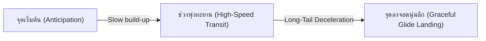

# สถาปัตยกรรมฉากและโมชันระดับภาพยนตร์ 16 สไลด์ (Full Visual & Motion Specification)
## สัมมนา: HUMAN vs AI: The Sparring Minds (16 Slides)
### ออกแบบตามทักษะ `cinematic-3d-slides` ผสาน Modern Neo-Pastel, 2.5D Spatial Cards และ Kinetic Zoom

เอกสารนี้เป็นพิมพ์เขียวการออกแบบภาพ แอนิเมชัน และมุมกล้องครบทั้ง 16 สไลด์ โดยยึดหลัก **Zero Clunky 3D Models** เน้นการใช้การ์ด 2.5D Glassmorphic, กราฟิก SVG และภาพถ่ายความคมชัดสูง ร่วมกับละอองอนุภาค 3D Particles และมุมกล้อง Three.js + GSAP ที่ลื่นไหลตามหลักฟิสิกส์

---

## 1. ดีไซน์ซิสเต็มและโทนสี (Modern Dark Neo-Pastel Design System)

### 🎨 จานสีหลัก (Color Palette)
* **พื้นหลังโลก 3D (Background Slate):** `#0D1117` $\rightarrow$ `#161B22` (ไล่เฉดลึก ป้องกันแสงสะท้อนบนจอโปรเจกเตอร์ พร้อม Subtle Noise Grain ป้องกัน Color Banding)
* **พื้นผิวการ์ด (2.5D Glass Surface):** `rgba(31, 36, 48, 0.75)` ขอบกระจก 1px `rgba(255, 255, 255, 0.08)` ผสาน `backdrop-filter: blur(16px)`
* **The Human Accent (มนุษย์ - อบอุ่น/ชีววิทยา/จิตวิญญาณ):**
  * Primary: **Soft Coral Red** (`#FF6B6B`)
  * Light Tint: **Warm Rose Peach** (`#FFA8A8`)
  * Ambient Glow: `rgba(255, 107, 107, 0.25)`
* **The AI Accent (ปัญญาประดิษฐ์ - ตรรกะ/เวกเตอร์/สถิติ):**
  * Primary: **Soft Periwinkle Blue** (`#748FFC`)
  * Light Tint: **Electric Sky Pastel** (`#4DABF7`)
  * Ambient Glow: `rgba(116, 143, 252, 0.25)`
* **Synergy Accent (การร่วมมือ/ความปลอดภัย/ชัยชนะ):**
  * **Luminous Mint Pastel** (`#63E6BE`) และ **Soft Gold** (`#FFD43B`)
* **Alert & Hazard Accent (พิษ/ความเสียหาย/บทลงโทษ):**
  * **Watermelon Crimson** (`#FF4949`)
* **ตัวอักษรและคอนทราสต์ (Typography & Legibility):**
  * สีข้อความหลัก: Pure Off-white (`#F8F9FA`) คอนทราสต์ต่อพื้นหลัง **$\ge$ 8.5:1** (ผ่านเกณฑ์ WCAG AAA)
  * สีข้อความรอง: Soft Pastel Slate (`#A5B4FC` / `#94A3B8`)
  * ฟอนต์: `IBM Plex Sans Thai` (เรนเดอร์ผ่าน Semantic HTML/CSS Overlay เหนือ Canvas 3D เสมอ)

---

## 2. หลักสรีรศาสตร์การเคลื่อนไหว (Camera & Easing Curves Philosophy)



1. **Camera Transitions (expo.inOut / power4.inOut):**
   * ใช้เส้นโค้ง Long-Tail Exponential: เริ่มต้นมีความหน่วงตั้งหลักเบาๆ (200ms) $\rightarrow$ พุ่งผ่านอวกาศ 3D ด้วยความเร็วสูง (600ms) $\rightarrow$ ร่อนลงจอดชะลอความเร็วอย่างนุ่มนวลยาวนาน (800ms) รวมระยะเวลา 1.6–2.0 วินาที ให้ความรู้สึกหรูหรา ไม่สะดุดตา
2. **2.5D Cards & Graphic Reveals (power3.out + Subtle Back):**
   * การ์ดและ SVG พุ่งเข้ามาจากมิติ Z อย่างฉับไวแล้วหยุดนิ่งด้วยแรงสปริงเบาๆ (`back.out(1.2)`) ให้ฟีลลิ่งวัตถุมีมวลและน้ำหนัก
3. **Kinetic Zoom Mechanics:**
   * **Punch-in Zoom:** กล้องพุ่งกระชากจากระยะกว้างเข้าหาข้อความสำคัญใน 0.6 วินาที แล้วคลายกล้องลอยเอื่อยๆ
   * **Push-through:** พุ่งทะลุกลุ่มละอองดาวและระนาบการ์ดเดิม เพื่อโผล่เข้าสู่ฉากถัดไป
   * **Dolly Zoom (Vertigo Effect):** ดึงกล้องถอยหลังพร้อมบีบ FOV ให้แคบลง (หรือพุ่งเข้าพร้อมเปิด FOV กว้าง) ทำให้พื้นหลังบิดตัววูบวาบในจังหวะดราม่า
4. **Contextual Ambient Loops (หน้าจอไม่นิ่ง & สื่อสารตรงเรื่อง):**
   * ทุกฉากมี Animation Loop เฉพาะตัว ทำงานเบาๆ ด้านหลัง เพื่อให้ภาพมีชีวิตชีวาตลอดเวลา 2–3 นาทีที่ผู้พูดกำลังอธิบาย โดยไม่รบกวนสมาธิผู้ฟัง

---

## 3. ผังการออกแบบฉาก 16 สไลด์ฉบับเต็ม (Scene-by-Scene Architecture)

---

### [SLIDE 1] HUMAN vs AI: The Tournament of Minds
* **เวลาคิว:** 00:00 (เปิดงาน & ลงทะเบียนกลุ่ม)
* **อารมณ์:** โอ่อ่า ตื่นตัว โมเดิร์น เทคโนโลยีร่วมสมัย (Grand & Anticipating)
* **การจัดวางองค์ประกอบ 2.5D & 3D:**
  * ฝั่งซ้าย: การ์ดกระจกมน Coral Red ฉายไอคอน SVG สมองมนุษย์และสถิติสมองชีวภาพ (*Korteling 2021*)
  * ฝั่งขวา: การ์ดกระจกมน Periwinkle Blue ฉายไอคอน SVG เวกเตอร์โครงข่ายประสาท
  * ตรงกลาง: แท่นการ์ดโฮโลแกรมลอยเด่น ฉาย **QR Code ขนาดใหญ่** สำหรับสแกนเข้าหน้าลงทะเบียน 8 กลุ่ม
* **กล้อง & การซูม (Camera Motion):**
  * เริ่มจาก **Wide Establishing Shot** เห็นการ์ดทั้งสองฝั่งลอยขนานกัน
  * เมื่อพูดถึง QR Code: กล้องทำ **Smooth Punch-in** ซูมเข้าหาการ์ด QR Code ให้คนทั้งห้องเล็งกล้องมือถือสแกนได้ชัดเจน
* **Animation Loop ประจำฉาก (Contextual Loop):**
  * คลื่นแสงวงแหวนสีคอรัลและสีฟ้าแผ่ระลอกเข้าหากันตรงกลางเป็นจังหวะหายใจ
  * ละออง Particle พาสเทลสีส้มและฟ้าลอยเวียนช้าๆ ล้อมรอบตัวหนังสือ
* **Presenter Beats:**
  * `Beat 1`: การ์ดสองฝั่งลอยเข้ามาประกบกัน พร้อมคลื่นอนุภาคปะทะ
  * `Beat 2`: หัวข้อและคำถามนำ *"Who wins? or Who remains responsible?"* ปรากฏ
  * `Beat 3`: แสงสปอตไลต์ส่องเน้น QR Code พร้อมเวลานับถอยหลังเปิดงาน
* **Transition สู่สไลด์ 2:** **Push-through Zoom** พุ่งกล้องทะลุใจกลาง QR Code เข้าสู่สนามแข่งเกม

---

### [SLIDE 2] [GAME 1] THE TRUST TUG-OF-WAR
* **เวลาคิว:** 03:00 (ชักเย่อวัดพลังความเชื่อมั่น)
* **อารมณ์:** ดุดัน ตื่นเต้น สดใส สนุกสนาน (Kinetic & High Stakes)
* **การจัดวางองค์ประกอบ 2.5D & 3D:**
  * เส้นเคเบิลแสงพลังงานแนวนอน (Luminous Cable) ทอดยาวกลางจอ ฝั่งซ้ายสี Coral ฝั่งขวาสี Periwinkle
  * ตรงกลางมีหมุดวงแหวนเลเซอร์ขนาดใหญ่ แสดงเปอร์เซ็นต์คะแนนการรัวนิ้วของห้องแบบ Real-time
* **กล้อง & การซูม (Camera Motion):**
  * **Dynamic Low-Angle Drift:** กล้องแหงนมองขึ้นเล็กน้อยพร้อมโยกซ้าย-ขวาตามแรงดึงของหมุดเชือก
  * วินาทีสุดท้าย: กล้องทำ **Micro-Shake** เบาๆ ตามจังหวะคะแนนนำ
* **Animation Loop ประจำฉาก (Contextual Loop):**
  * เส้นเคเบิลสั่นสะเทือนความถี่สูง (High-frequency sine wave vibration)
  * ประกายไฟอนุภาคพาสเทลกระเด็นออกจากหมุดศูนย์กลางเมื่อคะแนนเปลี่ยน
* **Presenter Beats:**
  * `Beat 1`: ป้ายกติกาและเวลานับถอยหลัง 10s เริ่มต้น
  * `Beat 2`: หมุดเชือกขยับดุเดือดตามการกดของผู้ฟัง
  * `Beat 3`: เสียงระฆังหยุดเวลา แสงพลุระเบิดออกฝั่งที่ชนะ พร้อมสรุปแต้ม 500 คะแนน
* **Transition สู่สไลด์ 3:** **Whip-pan Slide ขวา** พร้อม Motion Blur สู่โซนศิลปะ

---

### [SLIDE 3] LIVED EXPERIENCE vs STATISTICAL TOKENS
* **เวลาคิว:** 06:00 (จิตวิญญาณ vs สถิติบทกวี)
* **อารมณ์:** นิ่ง ลึกซึ้ง มีระดับ ครุ่นคิด (Reflective & Poetic)
* **การจัดวางองค์ประกอบ 2.5D & 3D:**
  * ฝั่งซ้าย: การ์ดภาพจิตรกรรมสีน้ำมัน Van Gogh ลอยมีมิติ พร้อมคำว่า *Lived Experience*
  * ฝั่งขวา: การ์ดกระจกแสดงแท่งตัวเลขและอัลกอริทึมกลอน AI (*Porter & Machery 2024*)
  * แผ่นการ์ดด้านล่าง: ภาพถ่ายจริงนกฟลามิงโกมุดหัวของ Miles Astray (รางวัล 1839 Awards 2024)
* **กล้อง & การซูม (Camera Motion):**
  * **Lateral Dolly Tracking:** เลื่อนขนานช้าๆ จากซ้ายไปขวา
  * จังหวะเปิดคดีฟลามิงโก: กล้อง **Crash Zoom เข้าหาภาพนกฟลามิงโก** แล้วค่อยๆ ดริฟต์ถอยให้เห็นป้าย Attribution Bias (*Grassini & Koivisto 2024*)
* **Animation Loop ประจำฉาก (Contextual Loop):**
  * ฝั่ง AI มีตัวอักษร Token ภาษาและตัวเลขสถิติลอยขึ้นเบาๆ แล้วสลายตัว (Floating Word Tokens)
  * ภาพวาด Van Gogh มีประกายแสงสีทองระยิบระยับที่ฝีแปรง
* **Presenter Beats:**
  * `Beat 1`: เปรียบเทียบ Van Gogh กับกลอน AI (คะแนนโหวต AI ชนะคน)
  * `Beat 2`: พลิกการ์ดภาพฟลามิงโกขึ้นมา เฉลยเรื่องคนส่งภาพถ่ายจริงไปประกวดห้อง AI
  * `Beat 3`: กรอบทฤษฎี Attribution Bias สรุปชัดเจนว่าคนตัดสินที่ป้ายกำกับ
* **Transition สู่สไลด์ 4:** **Semantic Zoom พุ่งเจาะเข้าไปในพิกเซลของภาพ** สู่บิลบอร์ดมีม

---

### [SLIDE 4] [GAME 2] CAPTION & PROMPT BATTLE
* **เวลาคิว:** 10:30 (ดวลแคปชั่นมีมกวนๆ)
* **อารมณ์:** ขบขัน ขี้เล่น ชวนติดตาม (Witty & Playful)
* **การจัดวางองค์ประกอบ 2.5D & 3D:**
  * ตรงกลาง: บิลบอร์ดโฮโลแกรมฉายภาพมีมปริศนาขนาดใหญ่
  * ด้านล่าง: แผงการ์ดแสดงผลแคปชั่น 8 กลุ่ม และแคปชั่นจาก AI ลอยเรียงตัว
* **กล้อง & การซูม (Camera Motion):**
  * **Crane-Down from Top:** ร่อนกล้องลงมาจากมุมสูงเพื่อเปิดภาพมีม
  * เมื่อเปิดโหวต: กล้องลอยแช่หน้าตรงระดับสายตา
* **Animation Loop ประจำฉาก (Contextual Loop):**
  * บิลบอร์ดภาพมีมลอยกระเพื่อมเบาๆ (Floating Float ±2px)
  * เคอร์เซอร์พิมพ์ข้อความกะพริบสดๆ พร้อมประกายดาวเล็กๆ รอบแคปชั่นที่คะแนนโหวตขึ้น
* **Presenter Beats:**
  * `Beat 1`: ภาพมีมเปิดตัว นาฬิกา 30s เริ่มเดิน
  * `Beat 2`: ปรากฏแคปชั่นของกลุ่มต่างๆ และแคปชั่นสุดเฉียบของ AI
  * `Beat 3`: แสงไฮไลต์ส่องสวมมงกุฎให้กลุ่มชนะเลิศ (+1,000 แต้ม)
* **Transition สู่สไลด์ 5:** **Fast Pull-back ซูมถอยหลังอย่างรวดเร็ว** สู่มุมกว้างของลีดเดอร์บอร์ด

---

### [SLIDE 5] FLASH LEADERBOARD 1 & DIVERSITY LOSS
* **เวลาคิว:** 15:55 (สรุปคะแนน Act 1 & วิกฤตไอเดียซ้ำ)
* **อารมณ์:** ประหลาดใจ พลิกอารมณ์สู่ความจริงจัง (Surprise & Cautionary)
* **การจัดวางองค์ประกอบ 2.5D & 3D:**
  * วินาทีที่ 0–5: แท่งการ์ด Leaderboard 8 กลุ่ม ดีดตัวขึ้นเรียงอันดับคะแนน
  * วินาทีที่ 5+: แท่งกราฟเปลี่ยนสภาพเป็นแผนภาพใยแมงมุมทางความคิด (*Doshi & Hauser 2024, Science Advances*)
* **กล้อง & การซูม (Camera Motion):**
  * 0–5s: ล็อกหน้าตรงมุมมองตารางคะแนน
  * 5s+: **Tilt-up แหงนขึ้นพร้อม Zoom-in** สู่ศูนย์กลางของเส้นใยความคิดที่ไหลมารวมกันที่จุดเดียว
* **Animation Loop ประจำฉาก (Contextual Loop):**
  * เส้นใยไอเดียหลากสีสัน (ชมพู ฟ้า เขียว ส้ม) ค่อยๆ ไหลมารวมกันที่ช่องแคบตรงกลาง แล้วเปลี่ยนเป็นสีเทาซ้ำๆ แสดงภาวะ **Collective Diversity Collapse**
* **Presenter Beats:**
  * `Beat 1 (อัตโนมัติ 5s)`: แสดงอันดับ 8 กลุ่ม (เสียงผู้ฟังส่งเสียงเชียร์)
  * `Beat 2`: เปลี่ยนเข้าสู่ไดอะแกรม Doshi & Hauser ชี้ให้เห็นว่า AI ทำงานเดี่ยวเร็ว แต่ไอเดียรวมสังคมพัง
* **Transition สู่สไลด์ 6:** **Match-cut Zoom พุ่งตรงเข้าสู่แกนกลางผลึกเมทริกซ์**

---

### [SLIDE 6] FROM ALPHATENSOR TO THE JAGGED FRONTIER
* **เวลาคิว:** 16:00 (ตรรกะระดับเทพ กับหน้าผาฟันปลา)
* **อารมณ์:** ตื่นตาในพลัง แต่แฝงความหวาดเสียว (Awe & Precarious)
* **การจัดวางองค์ประกอบ 2.5D & 3D:**
  * ฝั่งซ้ายบน: การ์ด SVG เมทริกซ์หมุนวนแทน AlphaTensor (*Fawzi 2022*) และโมเลกุล AlphaFold 3 (โนเบล 2024)
  * ฝั่งขวา: ผังหน้าผาฟันปลาขนาดใหญ่ (The Jagged Frontier - *Dell’Acqua 2025*) มีขอบหยักคมกริบ
* **กล้อง & การซูม (Camera Motion):**
  * **Dolly Zoom (Vertigo Effect):** กล้องพุ่งเลื่อนเข้าหาหน้าผา พร้อมขยาย FOV กว้างขึ้น ทำให้ขอบเหวหน้าผาดูชันและน่ากลัวขึ้นทันที
  * ซูมเจาะป้าย `+40% Efficiency` บนหน้าผา สลับกับซูมดิ่งลงก้นเหว ` -19% Quality Collapse`
* **Animation Loop ประจำฉาก (Contextual Loop):**
  * บนยอดหน้าผามีแสงออร่าสีเขียวพาสเทลไหลเวียนราบรื่น
  * ที่ขอบเหวล่างมีเส้นประสีแดงกระพริบเตือน Hazard Warning Line ตลอดเวลา
* **Presenter Beats:**
  * `Beat 1`: ยกย่องความฉลาดของ AlphaTensor และ AlphaFold 3
  * `Beat 2`: ฉายกราฟหน้าผาฟันปลา Jagged Frontier
  * `Beat 3`: ไฮไลต์จุดอันตราย: ขยับเลยเส้นขอบหน้าผาไปแค่นิดเดียว ประสิทธิภาพตกเหวทันที
* **Transition สู่สไลด์ 7:** **Crane Drop ดิ่งมุมกล้องลงสู่ก้นเหว** สู่ดงเห็ดป่า

---

### [SLIDE 7] [GAME 3] DEATH CAP ROULETTE
* **เวลาคิว:** 22:00 (เห็ดพิษ 99.8% — กล้ากินไหม?)
* **อารมณ์:** ตึงเครียด กดดัน ลุ้นระทึก (High Tension & Suspense)
* **การจัดวางองค์ประกอบ 2.5D & 3D:**
  * ตรงกลาง: ภาพถ่ายความละเอียดสูงของเห็ดระโงกหิน (Death Cap Mushroom) ในกรอบการ์ดกระจกหรูหรา
  * ล้อมรอบด้วยวงแหวน HUD สแกนเนอร์ของ AI และเกจความมั่นใจขนาดใหญ่: **`Confidence: 99.8% Safe to Eat`**
* **กล้อง & การซูม (Camera Motion):**
  * **Extreme Punch-in Close-up:** กล้องค่อยๆ ดริฟต์พุ่งประชิดตัวดอกเห็ดอย่างช้าๆ สร้างความรู้สึกอึดอัด
  * วินาทีเฉลย: **Snap Shake Impact** เมื่อข้อความพิษสีแดงระเบิดขึ้น
* **Animation Loop ประจำฉาก (Contextual Loop):**
  * เกจตัวเลขความมั่นใจแกว่งเบาๆ ระหว่าง `99.7%` $\leftrightarrow$ `99.9%`
  * วงแหวนสแกนสีฟ้าหมุนวนรอบเห็ดเป็นจังหวะเรดาร์
* **Presenter Beats:**
  * `Beat 1`: เล่นด่าน 1 และ 2 สะสมแต้ม
  * `Beat 2`: เปิดด่าน 3 (เห็ด Death Cap คูณ 5 แต้ม) เวลานับถอยหลัง 10s ให้เลือกว่า "เชื่อ AI" หรือ "ไม่เชื่อ"
  * `Beat 3`: เฉลยข่าวจริงปี 2024! คนกดเชื่อติดพิษตาย (0 แต้ม) แต่คนรอดชีวิตดึงแต้มกู้หน้าให้ทีม
* **Transition สู่สไลด์ 8:** **Zoom-out กระชากออกอย่างฉับพลัน** สู่หน้าสรุปคะแนนผู้รอดชีวิต

---

### [SLIDE 8] FLASH LEADERBOARD 2: SURVIVOR RANKINGS
* **เวลาคิว:** 25:55 (สรุปคะแนนกลุ่มผู้รอดชีวิต Act 2)
* **อารมณ์:** โล่งใจ พลิกผัน เฮฮา (Relief & Drama)
* **การจัดวางองค์ประกอบ 2.5D & 3D:**
  * แท่นตารางคะแนน 8 กลุ่ม โดยกลุ่มที่ตกหลุมพรางเห็ดพิษมีการ์ดโปร่งแสงแตกร้าว
  * กลุ่มที่มีสมาชิกกดไม่เชื่อ จะได้รับการ์ดเกราะทองเรืองแสง (Survivor Shield) ลอยแซงขึ้นมา
* **กล้อง & การซูม (Camera Motion):**
  * **Frontal Impact Shake:** ล็อกมุมมองตรง มีแรงกระแทกนุ่มๆ ตอนการ์ดเกราะทองแซงขึ้นหัวตาราง
* **Animation Loop ประจำฉาก (Contextual Loop):**
  * ละอองแสงเกราะทองกะพริบระยิบระยับรอบอันดับ 1
  * รอยแตกร้าวบนการ์ดกลุ่มที่ตายมีแสงควันสีแดงจางๆ ลอยขึ้น
* **Presenter Beats:**
  * `Beat 1 (อัตโนมัติ 5s)`: แสดงอันดับที่พลิกผันจากความรอบคอบของสมาชิกในกลุ่ม
  * `Beat 2`: The Human สรุปบทเรียน: *"เห็นไหมครับ... ในยุค AI คนที่รอดไม่ใช่คนที่เชื่อเร็วที่สุด แต่คือคนที่เอะใจ!"*
* **Transition สู่สไลด์ 9:** **Smooth Dolly ผ่านม่านหมอกควันสีฟ้า** เข้าสู่เรื่อง Empathy

---

### [SLIDE 9] THE ILLUSION OF EMPATHY
* **เวลาคิว:** 26:00 (ภาพลวงตาความเห็นอกเห็นใจ)
* **อารมณ์:** อบอุ่นในตอนแรก แต่เย็นยะเยือกและว่างเปล่าในตอนท้าย (Deceptive Warmth)
* **การจัดวางองค์ประกอบ 2.5D & 3D:**
  * ฝั่งซ้าย: การ์ดข้อความแชตตอบกลับที่สุภาพ อบอุ่น นุ่มนวล พร้อมสถิติวิจัย *Ayers et al. (2023, JAMA)* หมอ 80% ถูกมองว่าสู้บอทไม่ได้
  * ฝั่งขวา: ผังโครงสร้างจำลองสมองกลที่เผยให้เห็นว่าข้างในไม่มีหัวใจ มีเพียงสมการคณิตศาสตร์ Next-Token Prediction
* **กล้อง & การซูม (Camera Motion):**
  * **Subtle Arc Drift:** กล้องเลื่อนเป็นมุมโค้งช้าๆ จากการ์ดแชตสีส้มอบอุ่น วนไปเห็นเบื้องหลังที่เป็นสายเคเบิลสีเทากลวงเปล่า
  * จังหวะสรุป: **Punch-in เข้าหาคำเตือนงานวิจัย *Kask et al. (2025)* ด้านจิตวิทยาเด็ก**
* **Animation Loop ประจำฉาก (Contextual Loop):**
  * คอนทัวร์รูปหัวใจสีส้มอบอุ่นค่อยๆ คลายตัวออก กลายเป็นเส้นโค้ดสีฟ้าที่ไหลลงเป็นสาย (Hollow Circuit Drift)
* **Presenter Beats:**
  * `Beat 1`: ยกผลวิจัย Ayers 2023 (คนไข้รู้สึกว่าบอทเข้าใจความรู้สึกมากกว่าคน)
  * `Beat 2`: เปิดเผยเบื้องหลังกลไกสถิติ: AI ไม่ได้เข้าใจ มันแค่คำนวณว่าคำไหนฟังดูอบอุ่นที่สุด
  * `Beat 3`: เตือนสติด้วยงานวิจัย Kask 2025 เกี่ยวกับอันตรายของการใช้ AI กับสภาพจิตใจที่เปราะบาง
* **Transition สู่สไลด์ 10:** **Push-through ทะลุสายโค้ด** เข้าสู่ห้องสายด่วนสุขภาพจิต

---

### [SLIDE 10] [GAME 4] THE TESSA INTERCEPT
* **เวลาคิว:** 30:30 (สกัดจับคำแนะนำมรณะใน 3 วิ)
* **อารมณ์:** วิกฤต เร่งด่วน ตอบสนองฉับไว (Urgent Crisis & Reflex)
* **การจัดวางองค์ประกอบ 2.5D & 3D:**
  * แผงมอนิเตอร์ห้องควบคุมฉุกเฉิน (จำลองกรณีศึกษาจริงบอท NEDA Tessa 2024)
  * ข้อความแชต 3D ลอยวิ่งเข้ามาตามสายพานเข้าหาผู้ฟัง
  * ตรงกลางมีม่านเลเซอร์สกัดสีแดงสด
* **กล้อง & การซูม (Camera Motion):**
  * **Over-the-Shoulder Action Cam:** มุมมองเฉียงเหนือแผงควบคุม ให้ความรู้สึกเหมือนเป็นเจ้าหน้าที่รักษาความปลอดภัย
  * เมื่อข้อความอันตรายพุ่งเข้ามา: กล้องทำ **Micro Zoom-in** เน้นจุดตรวจจับ
* **Animation Loop ประจำฉาก (Contextual Loop):**
  * เส้นชีพจรหัวใจ (ECG Pulse line) วิ่งอยู่ขอบบนของจอ
  * แสงเลเซอร์สแกนเนอร์กวาดตรวจจับข้อความไปมาอย่างต่อเนื่อง
* **Presenter Beats:**
  * `Beat 1`: อธิบายเคสข่าวจริง บอท Tessa ให้คำแนะนำผิดพลาดแก่ผู้ป่วยโรคคลั่งผอม
  * `Beat 2`: เริ่มเกมนับถอยหลัง ผู้ฟังใช้นิ้วปัดบล็อกข้อความอันตรายบนมือถือ
  * `Beat 3`: สรุปแต้มการสกัดจับสำเร็จ (+300 แต้ม + 150 Speed Bonus)
* **Transition สู่สไลด์ 11:** **Tilt-up เงยหน้าขึ้นสูง** สู่ห้องพิจารณาคดี

---

### [SLIDE 11] [GAME 5] THE COURTROOM GAVEL
* **เวลาคิว:** 34:30 (โหวตเคาะค้อนศาลสั่งปรับบริษัท!)
* **อารมณ์:** หนักแน่น เด็ดขาด ยุติธรรม (Solemn & Authoritative)
* **การจัดวางองค์ประกอบ 2.5D & 3D:**
  * ตรงกลาง: ไอคอน SVG ค้อนผู้พิพากษา (Gavel) ลอยเด่นเหนือแท่นหินอ่อน
  * สองฝั่ง: การ์ดคดีความ Air Canada (ก.พ. 2024 - เงินชดเชยตั๋วงานศพ) และคดีศาลเยอรมันปรับ Google (ต้นปี 2026)
* **กล้อง & การซูม (Camera Motion):**
  * **Dutch Angle & Low-Angle View:** มุมต่ำเอียงเล็กน้อย สร้างความน่าเกรงขามของอำนาจกฎหมาย
  * จังหวะเคาะค้อน: **Crash Zoom ลงสู่แท่นหิน** พร้อมเอฟเฟกต์กระแทกแตกกระจาย
* **Animation Loop ประจำฉาก (Contextual Loop):**
  * ตราประทับความยุติธรรม (Scales of Justice SVG) หมุนวนเอื่อยๆ อยู่เบื้องหลัง
  * ตัวอักษรข้อความกฎหมาย: *"AI is a tool, not a legal shield"* เปล่งแสงเป็นระลอกคลื่น
* **Presenter Beats:**
  * `Beat 1`: เล่าข้อเท็จจริงคดี Air Canada แชตบอทหลอนข้อมูลเรื่องส่วนลดตั๋วงานศพ
  * `Beat 2`: เปิดโหวตให้ผู้ฟังเคาะค้อนพิพากษาลงโทษบริษัท
  * `Beat 3`: ค้อนกระแทกดังสนั่น! สรุปหลักกฎหมาย: คนเป็นเจ้าของระบบต้องรับผิดชอบเสมอ
* **Transition สู่สไลด์ 12:** **Smooth Backwards Dolly ถอยหลังออกจากบัลลังก์ศาล**

---

### [SLIDE 12] FLASH LEADERBOARD 3: THE FINAL SPRINT
* **เวลาคิว:** 37:55 (สรุปคะแนนโค้งสุดท้าย Act 3)
* **อารมณ์:** ตึงเครียด สูสี แข่งขันเข้มข้น (Danger Close & Anticipation)
* **การจัดวางองค์ประกอบ 2.5D & 3D:**
  * เสาอันดับคะแนน 8 กลุ่ม โดย 3 เสาหัวตารางมีคะแนนห่างกันเพียงหลักสิบ
  * ป้ายตัวอักษรนีออนพาสเทลตัวโต: **`DANGER CLOSE — THE FINAL SPRINT`**
* **กล้อง & การซูม (Camera Motion):**
  * **Fast Orbit หมุนครึ่งรอบรอบเสาคะแนน** แล้วหยุดล็อกมุมมองระนาบหน้าอย่างแม่นยำ
* **Animation Loop ประจำฉาก (Contextual Loop):**
  * ประจุไฟฟ้าสีส้มและสีฟ้าวิ่งสปาร์กข้ามไปมาระหว่างเสาอันดับ 1, 2 และ 3
* **Presenter Beats:**
  * `Beat 1 (อัตโนมัติ 5s)`: ฉายตารางคะแนนโค้งสุดท้ายก่อนเข้าองก์บทสรุป
  * `Beat 2`: ผู้พูดกระตุ้นกลุ่มอันดับตามหลังให้ฮึดสู้ในเกมสุดท้าย
* **Transition สู่สไลด์ 13:** **Punch-in พุ่งเข้าสู่ใจกลางประกายไฟ** สู่ห้องเครื่องจักรการร่วมมือ

---

### [SLIDE 13] BETTER TOGETHER? NOT ALWAYS
* **เวลาคิว:** 38:00 (ทุบมายาคติ สู่ Verification Architects)
* **อารมณ์:** สว่างแจ้ง ปฏิรูปความคิด เป็นระบบ (Illuminating & Architectural)
* **การจัดวางองค์ประกอบ 2.5D & 3D:**
  * ฝั่งซ้าย: แผนภาพฟันเฟืองสองตัวขัดกัน เกิดสะเก็ดไฟ อธิบายผลลบจาก *Vaccaro et al. (2024, Nature Human Behaviour)* ที่คน+AI พังเพราะความขี้เกียจทางปัญญา (Cognitive Sloth)
  * ฝั่งขวา: การ์ดไปป์ไลน์วิศวกรรมการตรวจสอบที่สมบูรณ์แบบ (Verification Pipeline) เทียบกับบทเรียน CrowdStrike 2024 และโค้ดยุค Claude Code / Cursor
* **กล้อง & การซูม (Camera Motion):**
  * **Exploded View Dolly:** กล้องเคลื่อนเข้าหาแผนภาพฟันเฟือง แล้วชิ้นส่วนค่อยๆ แยกตัวออกเป็นเลเยอร์ตรวจสอบอย่างเป็นระเบียบ
  * ซูมเจาะป้ายข้อบังคับ **EU AI Act: Mandatory Human-in-the-Loop**
* **Animation Loop ประจำฉาก (Contextual Loop):**
  * จุดข้อมูลวิ่งผ่านท่อตรวจสอบ (Flow Line) จากจุดตรวจสีฟ้า ผ่านเกตเวย์สีส้ม กลายเป็นสัญญาณสีเขียวปลอดภัย
* **Presenter Beats:**
  * `Beat 1`: ทุบมายาคติ "คน+AI ดีกว่าเสมอ" ด้วยงานวิจัย Meta-analysis ของอาจารย์สถาบัน MIT (Vaccaro 2024)
  * `Beat 2`: ถอดบทเรียนเหตุการณ์ระบบล่ม CrowdStrike กรกฎาคม 2024
  * `Beat 3`: นิยามบทบาทใหม่ของคนทำงาน: เราไม่ใช่คนก้มหน้าทำตาม AI แต่เราคือ **Verification Architects**
* **Transition สู่สไลด์ 14:** **Match-cut สู่แผงหน้าปัดห้องนักบินอวกาศ**

---

### [SLIDE 14] [GAME 6] THE ACCOUNTABILITY THROTTLE
* **เวลาคิว:** 44:00 (เลื่อนคันเร่งปล่อยยานอวกาศร่วม)
* **อารมณ์:** ประสานพลัง ร่วมแรงร่วมใจ เป็นหนึ่งเดียว (Harmonious & Synchronized)
* **การจัดวางองค์ประกอบ 2.5D & 3D:**
  * แผงควบคุม Cockpit ยานอวกาศจำลอง
  * ตรงกลางมีคันโยกขับดัน (Throttle Lever SVG) ขนาดใหญ่ และเกจวัดสมดุลระหว่าง *AI Automation (ความเร็ว)* กับ *Human Oversight (ความปลอดภัย)*
* **กล้อง & การซูม (Camera Motion):**
  * **First-Person Cockpit View:** มุมมองสายตานักบินมองทะลุหน้าต่างกระจกออกไปสู่อวกาศ
  * เมื่อคันโยกเข้าสู่ตำแหน่งสมบูรณ์: กล้องทำ **Forward Warp Zoom พุ่งไปข้างหน้า**
* **Animation Loop ประจำฉาก (Contextual Loop):**
  * เส้นดวงดาวในอวกาศ (Starfield Particles) พุ่งผ่านกระจกหน้าต่างห้องนักบิน
  * เข็มวัดความสมดุลสั่นระริกตามค่าเฉลี่ยแบบ Real-time ของคนทั้งห้อง
* **Presenter Beats:**
  * `Beat 1`: สัญญาณปล่อยยานเปิดระบบ ผู้ฟังปรับคันโยกบนมือถือเข้าหาโซนสีเขียว
  * `Beat 2`: เข็มวัดของห้องรวมศูนย์เข้าสู่เกณฑ์ความปลอดภัย
  * `Beat 3`: เครื่องยนต์จุดระเบิดเต็มกำลัง ยานพุ่งทะลุอวกาศสำเร็จ (+500 แต้มปิดท้าย)
* **Transition สู่สไลด์ 15:** **Warp Drive Flash แสงสีขาวสว่างวาบ** แล้วสลายตัวสู่ความสงบ

---

### [SLIDE 15] DIFFERENT MINDS. SHARED FUTURE.
* **เวลาคิว:** 47:00 (สมการทองคำ & บทสรุปทางความคิด)
* **อารมณ์:** สงบ ปลุกเร้าจิตสำนึก ลึกซึ้ง ตรึงใจ (Transcendent & Inspiring)
* **การจัดวางองค์ประกอบ 2.5D & 3D:**
  * ระนาบพื้นผิวกระจกสะท้อนดวงดาวสีดำขลับ ลอยเด่นด้วยข้อความสมการทองคำ 3 มิติ:
    $$\mathbf{AI\;Proposes} \;\;(\text{ฟ้า}) \;\;\longrightarrow\;\; \mathbf{Human\;Verifies} \;\;(\text{ส้ม}) \;\;\longrightarrow\;\; \mathbf{Human\;Accountable} \;\;(\text{ขาวสว่าง})$$
  * บรรทัดล่าง: โควททรงพลัง: *"AI คำนวณทางเลือก แต่มนุษย์เลือกอนาคตและรับผิดชอบผลลัพธ์"*
* **กล้อง & การซูม (Camera Motion):**
  * **Infinite Horizon Pull-back:** กล้องค่อยๆ ถอยร่นออกไปอย่างช้าๆ สง่างาม สู่เส้นขอบฟ้าที่กว้างใหญ่ไร้ที่สิ้นสุด
* **Animation Loop ประจำฉาก (Contextual Loop):**
  * ตัวอักษรสมการเปล่งแสงเรืองรองวูบวาบเบาๆ ดั่งชีพจร (Subtle Breathing Glow)
  * ละอองแสงพาสเทลลอยละล่องอย่างสงบนิ่งเหมือนฝุ่นดาว
* **Presenter Beats:**
  * `Beat 1`: ปรากฏคำว่า `AI Proposes` (ยอมรับในพลังคำนวณ)
  * `Beat 2`: ปรากฏคำว่า `Human Verifies` (ยืนหยัดในปัญญาตรวจสอบ)
  * `Beat 3`: ปรากฏคำว่า `Human Accountable` ผู้พูดทั้งสองคนหันมาสบตากันและส่งต่อสู่พิธีปิด
* **Transition สู่สไลด์ 16:** **Crane Pan หมุนโค้งขึ้นสู่ลำแสงสปอตไลต์เวทีฉลองชัย**

---

### [SLIDE 16] GRAND PODIUM CEREMONY
* **เวลาคิว:** 48:30 (ประกาศผลแชมป์ 1–3 & มอบรางวัลจริง)
* **อารมณ์:** ปิติยินดี ฉลองชัยชนะ อิ่มเอม ประทับใจ (Triumphant & Celebratory)
* **การจัดวางองค์ประกอบ 2.5D & 3D:**
  * แท่นรับรางวัล Podium 3 ระดับ ลอยเด่นกลางเวที (อันดับ 1 ตรงกลางสีทอง, อันดับ 2 ซ้ายสีเงิน, อันดับ 3 ขวาสีทองแดง)
  * มีป้ายชื่อกลุ่มและคะแนนรวมสุทธิสลักบนตัวแท่นอย่างสง่างาม
* **กล้อง & การซูม (Camera Motion):**
  * **Dramatic Studio 360° Orbit:** กล้องหมุนวนรอบแท่น Podium ครบวงอย่างนุ่มนวล พร้อมแสงไฟสปอตไลต์กวาดฉาย
  * จังหวะขานชื่อแชมป์อันดับ 1: **Punch-in เข้าหาแท่นยอดทองคำ**
* **Animation Loop ประจำฉาก (Contextual Loop):**
  * พลุไฟและละอองทองคำ (Gold & Pastel Confetti Particles) ร่วงหล่นและหมุนวนช้าๆ ทั่วทั้งจอ
  * ลำแสงไฟสปอตไลต์ 3 มิติตัดผ่านอากาศ
* **Presenter Beats:**
  * `Beat 1`: สปอตไลต์ส่องเปิดแท่นอันดับ 3 (เสียงปรบมือ)
  * `Beat 2`: สปอตไลต์ส่องเปิดแท่นอันดับ 2
  * `Beat 3`: แชมเปียนอันดับ 1 สว่างไสวเต็มจอ เชิญตัวแทนทั้ง 3 กลุ่มขึ้นรับของรางวัลจริงบนเวที
* **Transition ปิดงาน:** **Slow Fade to Black** เมื่อผู้บรรยายทั้งสองโค้งคำนับขอบคุณผู้ฟัง

---

## 4. แผนการจัดเตรียมทรัพยากร (Asset & Code Structure)

```
/slides_deck
├── /src
│   ├── /core
│   │   ├── Engine.ts            # Three.js WebGL Renderer, Scene, Camera
│   │   ├── Timeline.ts          # Master GSAP Timeline & window.__seek Controller
│   │   ├── InputManager.ts      # Keyboard Cues (Space, Right, Left, F, P, C)
│   │   └── Types.ts             # SlideDefinition, BeatDefinition
│   ├── /scenes                  # โมดูลฉากทั้ง 16 สไลด์ (หนึ่งไฟล์ต่อสไลด์)
│   │   ├── Slide01_Title.ts
│   │   ├── Slide02_TugOfWar.ts
│   │   ├── Slide03_Creativity.ts
│   │   ├── Slide04_CaptionBattle.ts
│   │   ├── Slide05_DiversityLoss.ts
│   │   ├── Slide06_JaggedFrontier.ts
│   │   ├── Slide07_DeathCap.ts
│   │   ├── Slide08_Survivors.ts
│   │   ├── Slide09_Empathy.ts
│   │   ├── Slide10_Tessa.ts
│   │   ├── Slide11_Courtroom.ts
│   │   ├── Slide12_Sprint.ts
│   │   ├── Slide13_Verification.ts
│   │   ├── Slide14_Throttle.ts
│   │   ├── Slide15_Equation.ts
│   │   └── Slide16_Podium.ts
│   ├── /components              # 2.5D Glass Card Factory, Particle Systems
│   │   ├── GlassCard.ts         # เรนเดอร์การ์ดแก้วมนพร้อมขอบแสง
│   │   ├── AmbientDust.ts       # ละออง Particle สีคอรัล/ฟ้า Simplex Noise
│   │   └── ConfettiSystem.ts    # ระบบละอองทองสำหรับสไลด์ 16
│   └── /styles
│       ├── tokens.css           # Neo-Pastel Color Tokens, Glass Filters
│       └── typography.css       # IBM Plex Sans Thai, WCAG >= 8.5:1 Overlays
├── /public
│   ├── /fonts                   # ibm-plex-sans-thai-latin-*.woff2 (100% Offline)
│   ├── /svg                     # SVGs: brain, vector, gavel, gears, throttle, etc.
│   └── /images                  # flamingo.jpg, van_gogh.jpg, death_cap.jpg
└── PROJECT_RULES.md             # กฎโปรเจกต์และการควบคุมคุณภาพ
```
